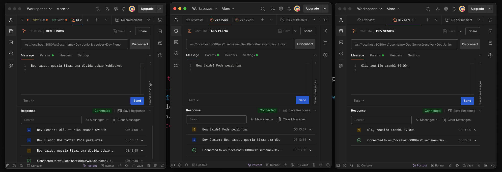

# TalkNow

TalkNow é um sistema de chat usando WebSocket, que permite aos usuários se comunicar uns com os outros em tempo real. O objetivo desse sistema é entender o funcionamento de sistemas de chat em tempo real, como o WhatsApp, Facebook Messenger, Slack, etc.

### Funcionalidade

- Chat em tempo real: os usuários podem se comunicar uns com os outros em tempo real.

### Tecnologias usadas

- Java
- Spring Boot
- WebSocket

### Como usar

1. Abra o Postman e crie duas ou mais requisições.
2. Selecione a opção "WebSocket" como o tipo de requisição.
3. Digite a URL do sistema (por exemplo, ws://localhost:8080/ws) e adicione os parâmetros username e receiver (por exemplo, ws://localhost:8080/ws?username=user1&receiver=user2), ws://localhost:8080/ws?username=user2&receiver=user1).
4. Clique no botão "Connect" para se conectar ao sistema.
5. Uma vez conectado, você pode enviar mensagens para o destinatário digitando no campo de texto e clicando no botão "Send".



### Método *handleMessage*
```java
// Método chamado quando uma mensagem é enviada pelo usuário
// Obtém o conteúdo da mensagem e o nome do usuário e do destinatário a partir da sessão e chama o método sendMessage do TalkNowService para enviar a mensagem
@Override
public void handleMessage(WebSocketSession session, WebSocketMessage<?> message) throws Exception {
    if (message instanceof TextMessage) {
        TextMessage textMessage = (TextMessage) message;
        String content = textMessage.getPayload().toString();
        if (content != null) {
            if (session.getAttributes().containsKey("username") && session.getAttributes().containsKey("receiver")) {
                String username = session.getAttributes().get("username").toString();
                String receiver = session.getAttributes().get("receiver").toString();
                talkNowService.sendMessage(session, username, receiver, content);
            } else {
                throw new Exception("O atributo 'username' ou 'receiver' não está presente na sessão");
            }
        }  else {
            throw new Exception("O conteúdo da mensagem é nulo");
        }
    }
}
```


